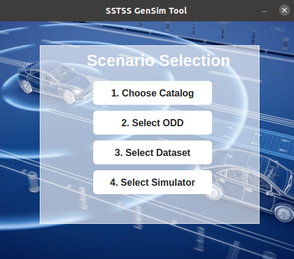

# SSTSS-GenSim Tool
SSSTSS-GenSim is a modular end-to-end pipeline for scenario-based safety testing of Automated Driving Systems (ADS).
It streamlines the complete workflow from scenario selection, scenario implementation, scenario configuration, simulation, data collection, safety-metric evalaution, and visualization and simulation summary report generation.

---

## GUI for the Scenario Selection Module

<p align="center">
    
</p>

## Workflow
 **Launch the Tool** – Run the main Python script.
** 1. Scenario Selection Module:** Prioritze and selects the test sceanrio based on SSTSS process. It takes four inputs:

i. **Select Catalog** – Choose the dataset region (US, Singapore, Other). 
         
ii. **Select ODD** – Narrow down scenarios based on operational design domain, i.e, (Dynamic, Environmental, Scenery ).

iii. **Select Dataset** –  Choose the dataset US or Europe Singapore.

iv. **Select Simulator** – Choose the simulator.(Currently you can select CARLA)

_Output._ **Final list of Test Scenarios** – List of test scenarios for testing or simulation.
**Scenario Implementation Module:** Converts the top-prioritized scenario into a Python script that defines the actors and their behaviors. Output --> (<scenario_name.py>)

**Scenario Configuration Module:** Configures the simulation environment and applies the selected input parameters.

**Simulator and ADS Integration Module:** Sets up the simulation environment, including CARLA, ScenarioRunner, and Autoware-mini.

**Scenario Execution Module:** Runs the configured scenario in CARLA using the integrated simulation setup.

**Data Collection Module:** Captures all relevant simulation outputs, including timestamps, positions, and speeds of all actors.

**Safety Metrics Evaluation Module:** Computes the safety metrics for assessing ADS performance.

**Data Visualization and Report Module:** Generates plots, summary reports, based on the collected data.


Organizes and stores output files for each parameter configuration in a structured format for analysis.
## Installation

### 1. Clone the Repository
```bash

git clone https://github.com/<your-username>/SSTSS-GenSim.git
cd SSTSS-GenSim
```


### 2. Install Python Dependencies

Install required libraries (Python 3.8+ recommended):

```bash
pip install -r requirements.txt
```

### 3. Install and Configure CARLA (for Simulation Execution)

Download CARLA 0.9.13
https://carla.org/

Extract CARLA to your preferred location
Add CARLA PythonAPI to PYTHONPATH:
```bash
export PYTHONPATH=$PYTHONPATH:/path/to/CARLA_0.9.13/PythonAPI/carla/dist/carla-0.9.13-py3.8-linux-x86_64.egg
export PYTHONPATH=$PYTHONPATH:/path/to/CARLA_0.9.13/PythonAPI/carla

```
(Replace paths with your system locations.)
### 4. Autoware_mini Installation 
Clone the repository into your ROS workspace:
```bash
cd ~/catkin_ws/src
git clone https://github.com/UT-ADL/autoware_mini.git
```
Install dependencies:
```bash
rosdep install --from-paths . --ignore-src -r -y
```
Build:
```bash
bash
cd ~/catkin_ws
catkin_make
```
Source the workspace:
```bash
bash
source ~/catkin_ws/devel/setup.bash
```
For complete instructions, refer to:
https://github.com/UT-ADL/autoware_mini

### 5. ScenarioRunner Installation

Download ScenarioRunner (compatible with CARLA 0.9.13):
```bash
git clone https://github.com/carla-simulator/scenario_runner.git

```
Set the root path inside config.py:
```bash
SCENARIO_RUNNER_ROOT = "/home/user/scenario_runner"

```
5. Configure SSTSS-GenSim Tool Paths

Edit config.py inside the tool:
```bash
TOOL_ROOT = "/path/to/SSTSS_GenSim_Modules"
CARLA_ROOT = "/path/to/CARLA_0.9.13"
SCENARIO_RUNNER_ROOT = "/path/to/scenario_runner"
RESULTS_DIR = "os.path.join(TOOL_ROOT, "Data_Collection_Module", "raw_data"

```
6. Launch the Tool

Run the main GUI:
```bash
python main.py

```
----
**Authors:**  
Fauzia Khan, Hina Anwar, Deitmar Pfahl, "SSTSS-GenSim: A Modular Tool Chain for End-to-End Safety Evaluation of Automated Driving Systems".

---

